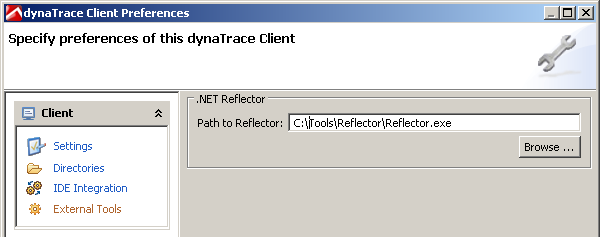
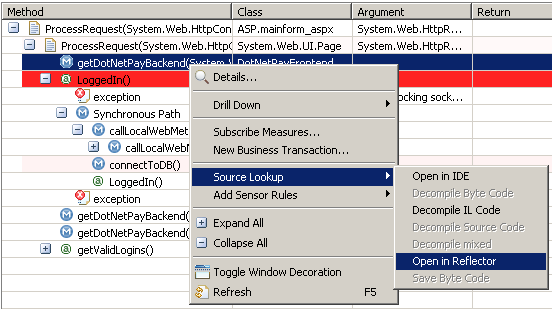
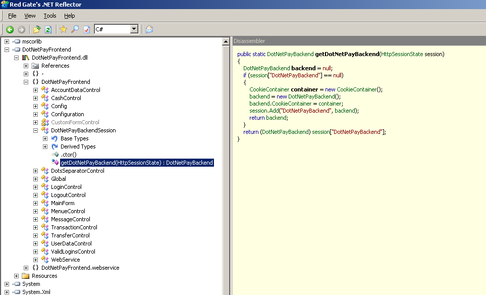

<html xmlns="http://www.w3.org/1999/xhtml">
<head>
    <title>.NET Reflector Plugin</title>
    <meta http-equiv="Content-Type" content="text/html; charset=UTF-8"/>
    <meta http-equiv="X-UA-Compatible" content="IE=EmulateIE8" />
    <meta content="Scroll Wiki Publisher" name="generator"/>
</head>
<body>
                <h1>.NET Reflector Plugin</h1>
    

        <h2>Overview</h2>
    

            
        The dynaTrace Plugin for .NET Reflector allows you to lookup code from the PurePath or Methods view. The dynaTrace Client launches the .NET Reflector and opens the disassembled assembly from the selected method in the PurePath or Methods view.    

    

        <table>
<thead class=" "></thead><tfoot class=" "></tfoot><tbody class=" ">    <tr>
            <td rowspan="1" colspan="1">
        

Name    

            </td>
                <td rowspan="1" colspan="1">
        

<strong class=" ">.NET Reflector Plugin</strong>    

            </td>
        </tr>
    <tr>
            <td rowspan="1" colspan="1">
        

dynaTrace Version    

            </td>
                <td rowspan="1" colspan="1">
        

3.0+, 3.2+, 3.5, 4, 4.x, 5.x, 6.0    

            </td>
        </tr>
    <tr>
            <td rowspan="1" colspan="1">
        

.NET Reflector Version    

            </td>
                <td rowspan="1" colspan="1">
        

5+, 7    

            </td>
        </tr>
    <tr>
            <td rowspan="1" colspan="1">
        

Support    

            </td>
                <td rowspan="1" colspan="1">
        

<a href="https://community.compuwareapm.com/community/display/DL/Support+Levels#SupportLevels-Supported">Supported</a>    

            </td>
        </tr>
    <tr>
            <td rowspan="1" colspan="1">
        

Download    

            </td>
                <td rowspan="1" colspan="1">
        

<a href="ReflectorPlugin7.dt60.zip">Download dynaTrace 6.0 Plugin for .NET Reflector 7</a> 
<a href="ReflectorPlugin5.dt60.zip">Download dynaTrace 6.0 Plugin for .NET Reflector 5</a> 
<a href="ReflectorPlugin7.dt56.zip">Download dynaTrace 5.6 Plugin for .NET Reflector 7</a> 
<a href="ReflectorPlugin5.dt56.zip">Download dynaTrace 5.6 Plugin for .NET Reflector 5</a> 
<a href="Reflector6.zip">Reflector 6 (ZIP)</a> 
<a href="http://www.red-gate.com/products/reflector/">Download .NET Reflector from RedGate</a> 
<a href="dynaTrace_NETReflector_Plugin_v3.0.1.zip">Download dynaTrace Plugin for .NET Reflector 5</a> 
<a href="dynaTrace_NETReflector7_Plugin.zip">Download dynaTrace Plugin for .NET Reflector 7</a>    

            </td>
        </tr>
</tbody>        </table>
            

    

    

        <h2>Plugin Information</h2>
    

.NET Reflector enables you to easily view, navigate, and search through, the class hierarchies of .NET assemblies, even if you don't have the code for them. With it, you can decompile and analyze .NET assemblies in C#, Visual Basic, and IL    

    

    

        <h2>Installation</h2>
    

    <ol class=" "><li class=" ">    

Download both packages from the link locations mentioned above locally to the computer where the dynaTrace Client is installed.    

</li><li class=" ">    

Unzip both files.    

</li><li class=" ">    

Open .NET Reflector and choose Add-Ins from the View menu    

</li><li class=" ">    

Add the extracted ReflectorPlugin.dll (for Reflector 5) or ReflectorPlugin7.dll (for Reflector 7) - this enables the Plugin on the .NET Reflector side    

</li><li class=" ">    

Open dynaTrace Client    

<ol class=" "><li class=" ">    

In version 3.2.x open the Preferences menu from the Tools menu.    

</li><li class=" ">    

In version 3.5 (or later) open the &quot;dynaTrace Client&quot; menu in the Settings menu.    

</li></ol></li><li class=" ">    

Switch to &quot;External Tools&quot; and specify the installation path of .NET Reflector    

</li></ol>    

    

    

        <h2>Screenshots</h2>
    

Configure Reflector in dynaTrace Client Preferences             
            

    

Invoke Source Lookup from PurePath View             
            

    

Disassembled method in .NET Reflector             
            

    

            

        

        

        

    

</body>
</html>
